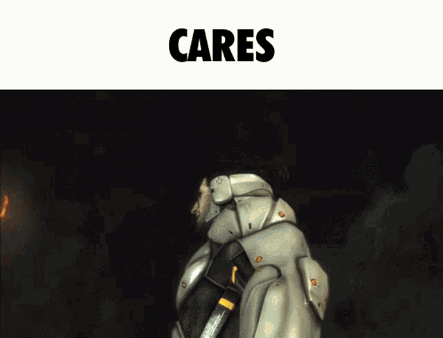
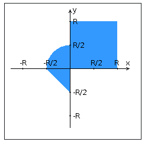

# Лабы по вебу (ИТМО, сем 3) #
## чего? вставить нормальное описание? ##

## лови лучше крысу ##

---------------------------------------

# Лабораторная работа №4
# _IN PROGRESS_

## Check out this site live: (IN PROGRESS) ##

## Вариант: 66651 ##

Переписать приложение из предыдущей лабораторной работы с использованием следующих технологий:

- Уровень back-end должен быть основан на Spring.
- Уровень front-end должен быть построен на React + Redux (необходимо использовать ES6 и JSX) с использованием обычных полей ввода HTML
- Взаимодействие между уровнями back-end и front-end должно быть организовано посредством REST API.

Приложение по-прежнему должно включать в себя 2 страницы - стартовую и основную страницу приложения. Обе страницы приложения должны быть адаптированы для отображения в 3 режимах:

- "Десктопный" - для устройств, ширина экрана которых равна или превышает 1153 пикселей.
- "Планшетный" - для устройств, ширина экрана которых равна или превышает 850, но меньше 1153 пикселей.
- "Мобильный"- для устройств, ширина экрана которых меньше 850 пикселей.

**Стартовая страница должна содержать следующие элементы:**

- "Шапку", содержащую ФИО студента, номер группы и номер варианта.
- Форму для ввода логина и пароля. Информация о зарегистрированных в системе пользователях должна храниться в отдельной таблице БД (пароль должен храниться в виде хэш-суммы). Доступ неавторизованных пользователей к основной странице приложения должен быть запрещён.

**Основная страница приложения должна содержать следующие элементы:**

- Набор полей ввода для задания координат точки и радиуса области в соответствии с вариантом задания: Checkbox {'-4','-3','-2','-1','0','1','2','3','4'} для координаты по оси X, Text (-3 ... 3) для координаты по оси Y, и Checkbox {'-4','-3','-2','-1','0','1','2','3','4'} для задания радиуса области. Если поле ввода допускает ввод заведомо некорректных данных (таких, например, как буквы в координатах точки или отрицательный радиус), то приложение должно осуществлять их валидацию.
- Динамически обновляемую картинку, изображающую область на координатной плоскости в соответствии с номером варианта и точки, координаты которых были заданы пользователем. Клик по картинке должен инициировать сценарий, осуществляющий определение координат новой точки и отправку их на сервер для проверки её попадания в область. Цвет точек должен зависить от факта попадания / непопадания в область. Смена радиуса также должна инициировать перерисовку картинки.
- Таблицу со списком результатов предыдущих проверок.
- Кнопку, по которой аутентифицированный пользователь может закрыть свою сессию и вернуться на стартовую страницу приложения.

**Дополнительные требования к приложению:**

- Все результаты проверки должны сохраняться в базе данных под управлением СУБД PostgreSQL.
- Для доступа к БД необходимо использовать Spring Data.

**Вопросы к защите лабораторной работы:**

1. Платформа Java EE. Спецификации и их реализации.
2. Принципы IoC, CDI и Location Transpanency. Компоненты и контейнеры.
3. Управление жизненным циклом компонентов. Дескрипторы развёртывания.
4. Java EE API. Виды компонентов. Профили платформы Java EE.
5. Компоненты EJB. Stateless & Stateful Session Beans. EJB Lite и EJB Full.
6. Работа с электронной почтой в Java EE. JavaMail API.
7. JMS. Реализация очередей сообщений. Способы доставки сообщений до клиента. Message-Driven Beans.
8. Понятие транзакции. Управление транзакциями в Java EE. JTA.
9. Веб-сервисы. Технологии JAX-RS и JAX-WS.
10. Платформа Spring. Сходства и отличия с Java EE.
11. Модули Spring. Архитектура Spring Runtime. Spring Security и Spring Data.
12. Реализация IoC и CDI в Spring. Сходства и отличия с Java EE.
13. Реализация REST API в Java EE и Spring.
14. React JS. Архитектура и основные принципы разработки приложений.
15. Компоненты React. State & props. "Умные" и "глупые" компоненты.
16. Разметка страниц в React-приложениях. JSX.
17. Навигация в React-приложениях. ReactRouter.
18. Упрвление состоянием интерфейса. Redux.
19. Angular: архитектура и основные принципы разработки приложений.
20. Angular: модули, компоненты, сервисы и DI.
21. Angular: шаблоны страниц, жизненный цикл компонентов, подключение CSS.
22. Angular: клиент-серверное взаимодействие, создание, отправка и валидация данных форм.

