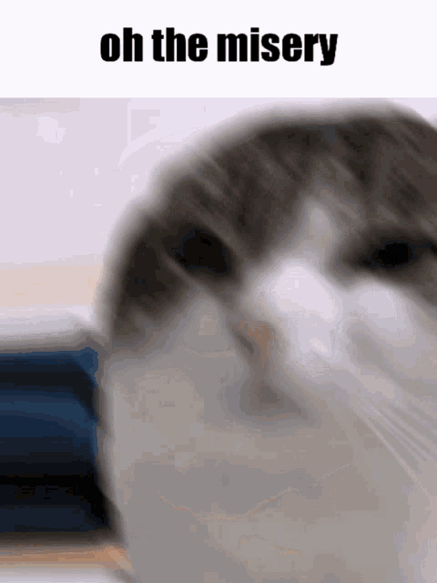

# Лабораторная работа №1
## Check out this site live: гелиос живой, сайт тут -> [click](https://se.ifmo.ru/~s336765/lab1/index.html)) ##

## но я расскажу как захостить это самому ##

1. качаем/клонируем/перепечатываем побуквенно этот репозиторий
2. открываем консоль
3. переходим в папку lab1 (где index.html лежит)
4. делаем "php -S localhost:8080" (у меня версия php 7.4.3)
5. радостно открываем в браузере localhost:8080  и смотрим на это убожество

## Вариант: 3116 ##

Разработать PHP-скрипт, определяющий попадание точки на координатной плоскости в заданную область, и создать HTML-страницу, которая формирует данные для отправки их на обработку этому скрипту.

Параметр R и координаты точки должны передаваться скрипту посредством HTTP-запроса. Скрипт должен выполнять валидацию данных и возвращать HTML-страницу с таблицей, содержащей полученные параметры и результат вычислений - факт попадания или непопадания точки в область. Предыдущие результаты должны сохраняться между запросами и отображаться в таблице.

Кроме того, ответ должен содержать данные о текущем времени и времени работы скрипта.

**Разработанная HTML-страница должна удовлетворять следующим требованиям:**
- Для расположения текстовых и графических элементов необходимо использовать табличную верстку.
- Данные формы должны передаваться на обработку посредством POST-запроса.
- Таблицы стилей должны располагаться в отдельных файлах.
- При работе с CSS должно быть продемонстрировано использование селекторов псевдоклассов, селекторов псевдоэлементов, селекторов атрибутов, селекторов элементов а также такие свойства стилей CSS, как наследование и каскадирование.
- HTML-страница должна иметь "шапку", содержащую ФИО студента, номер группы и новер варианта. При оформлении шапки необходимо явным образом задать шрифт (fantasy), его цвет и размер в каскадной таблице стилей.
- Отступы элементов ввода должны задаваться в пикселях.
- Страница должна содержать сценарий на языке JavaScript, осуществляющий валидацию значений, вводимых пользователем в поля формы. Любые некорректные значения (например, буквы в координатах точки или отрицательный радиус) должны блокироваться.

**Вопросы к защите лабораторной работы:**

1. Протокол HTTP. Структура запросов и ответов, методы запросов, коды ответов сервера, заголовки запросов и ответов.
2. Язык разметки HTML. Особенности, основные теги и атрибуты тегов.
3. Структура HTML-страницы. Объектная модель документа (DOM).
4. HTML-формы. Задание метода HTTP-запроса. Правила размещения форм на страницах, виды полей ввода.
5. Каскадные таблицы стилей (CSS). Структура - правила, селекторы. Виды селекторов, особенности их применения. Приоритеты правил. Преимущества CSS перед непосредственным заданием стилей через атрибуты тегов.
6. LESS, Sass, SCSS. Ключевые особенности, сравнительные характеристики. Совместимость с браузерами, трансляция в "обычный" CSS.
7. Клиентские сценарии. Особенности, сферы применения. Язык JavaScript.
8. Версии ECMAScript, новые возможности ES6 и ES7.
9. Синхронная и асинхронная обработка HTTP-запросов. AJAX.
10. Библиотека jQuery. Назначение, основные API. Использование для реализации AJAX и работы с DOM.
11. Реализация AJAX с помощью SuperAgent.
12. Серверные сценарии. CGI - определение, назначение, ключевые особенности.
13. FastCGI - особенности технологии, преимущества и недостатки относительно CGI.
14. Язык PHP - синтаксис, типы данных, встраивание в веб-страницы, правила обработки HTTP-запросов. Особенности реализации принципов ООП в PHP.

</img>
